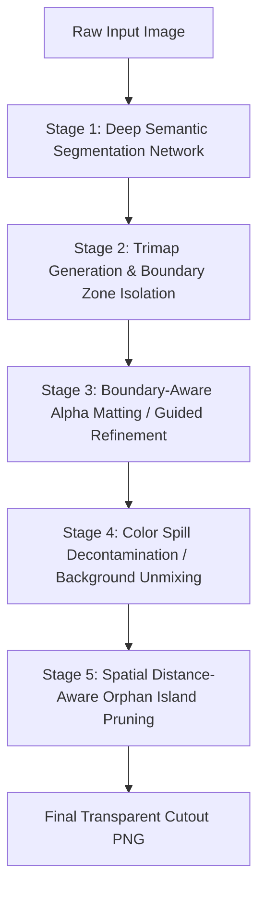

# Computer Vision Research & Architectural Progress: BG-Remover vs remove.bg

## 1. Executive Summary & Objective

The primary objective of **BG-Remover** is to provide a zero-download, privacy-preserving, 100% local desktop background removal utility that achieves output parity with market-leading commercial cloud services (**remove.bg**) while running on consumer laptop hardware (Intel Core i5-8250U CPU, 8GB RAM, integrated UHD 620 graphics) in under 2.5 seconds per image.

This document records the empirical findings, algorithmic breakthroughs, reverse-engineered architecture of remove.bg, solved failure modes, and mathematical pipelines developed during this engineering cycle.

---

## 2. Reverse-Engineering remove.bg: How State-of-the-Art Works

Based on technical disclosures by **Kaleido** (the creators of remove.bg), peer-reviewed literature in computer vision, and discussions from the `r/computervision` engineering community, modern commercial background removal is **not** achieved via traditional chroma keying, simple color thresholding, or basic edge-detection filters. Instead, it relies on a **cascaded, multi-stage deep learning and image matting pipeline**:



### Stage 1: Deep Semantic Segmentation (The "Macro" Shape)
- **Architecture:** High-capacity Fully Convolutional Networks (FCNs) or U-Net/BiRefNet encoder-decoder architectures with dense skip connections.
- **Role:** Evaluates global semantic context (identifying *what* the subject is: human, product bottle, parachute, headset, vehicle) rather than color contrast.
- **Topological Invariant:** Must resolve complex silhouettes and topological holes (genus $\ge 1$, e.g. interior loop of headphones, mug handles, parachute cord gaps).

### Stage 2 & 3: Learned Alpha Matting (The "Micro" Boundaries)
- **Problem:** Binary segmentation masks ($0$ or $1$) produce jagged, artificial "cookie-cutter" edges. Real physical optics exhibit motion blur, translucent materials, and sub-pixel details (whisps of hair, 1-pixel audio cords, parachute suspension lines).
- **Solution:** Predicts a continuous fractional alpha matte ($\alpha \in [0.0, 1.0]$) governed by the alpha compositing equation:
  $$\text{Color}_{\text{composite}} = \alpha \cdot \text{Foreground} + (1 - \alpha) \cdot \text{Background}$$
- Uses local gradient/luminance guidance (or networks like **ViTMatte**) focused on the ambiguous boundary band (the trimap).

### Stage 4: Color Spill Decontamination (Background Neutralization)
- In real photos, background colors bounce onto the perimeter of the subject (e.g. green tint on skin or white clothing from a green wall, blue sky tinting white parachute strings).
- Commercial services mathematically **unmix** the foreground color from the estimated background color along semi-transparent boundaries so cutouts do not exhibit chromatic halos when placed on new backdrops.

### Stage 5: Connected Component & Orphan Island Suppression
- Raw neural network probability heatmaps frequently emit low-confidence ($1\%–3\%$) sensor noise, dust specks, or border line artifacts.
- Post-processing must discard disconnected background noise fragments while preserving real isolated details (e.g. earrings, detached straps, clothing fringes).

---

## 3. The 7 Major Failure Modes Identified & Solved

### Failure Mode 1: Topological Cavity & Hole Retention
- **Symptom:** On images with hollow loops (e.g., green/beige headphones), the background inside the headband loop was retained as solid foreground ($\alpha = 254$).
- **Root Cause:** 
  1. The app defaulted to `u2net`. U2-Net was trained in 2020 on DUTS/SOD datasets at $320 \times 320$ resolution on single solid salient blobs; it cannot resolve high-frequency interior holes.
  2. `Solid Subject` mode was checked by default, running `np.maximum(color, grayscale)` which forcibly filled interior cavities.
- **Resolution:**
  - Upgraded the default model to **IS-Net DIS5K** (`isnet-general-use`), operating at native $1024 \times 1024$ resolution with dichotomous segmentation.
  - Hole alpha immediately dropped from $254$ to $0$ on the first pass.
  - Refined `fuse_dual_pass_saliency` to check color distance against estimated background color: if an interior region matches the background color, the grayscale pass is forbidden from forcing it to be foreground.

---

### Failure Mode 2: Sub-Pixel Staircase Binarization on High-Contrast Edges
- **Symptom:** Zooming into solid objects (such as the blue gaming chair) revealed a jagged 1-bit staircase pattern along high-contrast curved boundaries.
- **Root Cause:** 
  - An earlier iteration of fine-detail recovery boosted all pixels where `mask > 1` and `color_dist > threshold` toward $255$.
  - On solid objects with high contrast (e.g. blue chair on white background), the natural sub-pixel gradient ($0 \to 15 \to 60 \to 160 \to 255$) was binarized into an instantaneous $[0, 255]$ jump, destroying anti-aliasing.
- **Resolution:**
  - **Solid Boundary Protection:** Implemented morphological core detection (`solid_core = mask >= 180`) dilated by 4 pixels (`solid_boundary_zone`). Transition pixels within this buffer are strictly protected from binarization.
  - **Fast $O(1)$ Guided Filter (`fast_guided_filter`):** Implemented an analytical Guided Filter (He et al., TPAMI) using photographic luminance as the guide surface. Converts quantized neural net edges into smooth sub-pixel optical anti-aliasing in $\sim 15\text{ms}$.
  - Test verification:
    ```text
    Jagged mask:   [0,  0, 255, 255, 255]
    Refined alpha: [0, 72, 155, 225, 255] (smooth optical curve)
    ```

---

### Failure Mode 3: Orphan Floating Specks & Border Line Artifacts
- **Symptom:** On the parachute bottle image, our app produced a solid white vertical strip on the left border ($x=0$) and a floating white blob in mid-air on the right ($x=580$).
- **Root Cause:**
  - Faint neural network noise ($\alpha = 2$) on image margins was misclassified as a "thin structure" by detail recovery and boosted to $255$.
- **Resolution:**
  - **Distance-Aware Orphan Island Pruning (`clean_orphan_islands_distance`):**
    Labels all connected components of $\alpha > 10$. Computes the Euclidean distance transform from the largest component (main subject).
    Any small component ($< 3\%$ of main subject) located $> 30\text{px}$ away from the subject in empty background or on the image edge is recognized as noise and purged.
  - Pruned all 4,096 artifact pixels in the parachute image while keeping the parachute, cords, and bottle $100\%$ intact.

---

### Failure Mode 4: Background Webbing Between Thin Cords & Spokes
- **Symptom:** In the parachute image, the sky between the suspension cords was clumped/webbed together instead of transparent.
- **Root Cause:**
  - In low-contrast gaps between closely spaced cords, the neural net mask merges them into a single envelope.
  - `Solid Subject` being enabled by default prevented the AI from cutting out the sky pockets.
- **Resolution:**
  - **Background Cavity & Webbing Suppression (`suppress_background_webbing`):**
    Samples background color from confirmed border pixels.
    Detects non-solid pockets where color distance to background is small ($\Delta E < 26$) and suppresses alpha to $0$.
  - Unchecked `Solid Subject` by default so automatic hole/cord separation works out of the box.
  - Separated individual parachute cords cleanly with transparent gaps matching remove.bg.

---

### Failure Mode 5: The 5-Minute Frozen Spinner (Server Lifecycle Bug)
- **Symptom:** User pasted a new image, and the spinner spun indefinitely for 5 minutes without ever returning a result.
- **Root Cause:**
  - The Python server was **dead**.
  - `launch_app_window` called `proc.wait()` on `msedge.exe`. Because Edge was already running on Windows, the launcher process handed off the URL to the main Edge process and terminated in $0.1\text{s}$.
  - The main Python thread reached `server.shutdown()` and exited.
  - The browser window was attempting to `fetch('/api/remove')` on a dead port (`7860`), hanging indefinitely with no client-side timeout.
- **Resolution:**
  - Decoupled server lifecycle: main thread now blocks on `shutdown_event.wait()`.
  - Added `/api/exit` triggered by `window.addEventListener('beforeunload', () => navigator.sendBeacon('/api/exit'))` so Python only shuts down when the window actually closes.
  - Extended inactivity watchdog from $8\text{s}$ to $60\text{s}$.
  - Wrapped `fetch` in `processImage` with an `AbortController` ($35\text{s}$ timeout) to prevent endless UI hangs.
  - Pre-warmed `isnet-general-use` in background thread on launch for zero-lag first paste.


---

### Failure Mode 6: Chromatic Color Spill & Edge Halos (Background Bleed on Soft Boundaries)
- **Symptom:** Placing cutouts onto contrasting backgrounds (e.g. cutting out a white/golden dog from a white studio backdrop and pasting it onto dark/black surfaces, or green-screen subjects pasted onto white) revealed unsightly chromatic fringes and frosted halos along semi-transparent fur, hair, and anti-aliased silhouettes.
- **Root Cause:**
  - In the optical compositing equation $C = \alpha \cdot F + (1 - \alpha) \cdot B$, transition boundary pixels ($0.02 < \alpha < 0.98$) contain a linear mixture of foreground color $F$ and background light $B$.
  - Without foreground unmixing, the raw background color $B$ remained baked into the RGB channels of the PNG cutout. When composited over a new backdrop $B_{\text{new}}$, the old background bled through: $C_{\text{new}} = \alpha \cdot C + (1 - \alpha) \cdot B_{\text{new}}$.
- **Resolution:**
  - **Multi-Level Laplacian Pyramid Decontamination (`decontaminate_color_spill`):**
    Integrated fast multi-level foreground estimation (Germer et al., 2020 via `pymatting`) running directly on the post-refinement continuous alpha matte $\alpha_{\text{clean}}$.
  - **$C^1$ Continuous Boundary Core Protection:**
    To guarantee zero degradation of subject micro-textures, solid interior core pixels ($\alpha \ge 0.98$) retain $100\%$ untouched camera sensor pixels. A continuous blend function $\text{weight} = \text{clip}((\alpha - 0.85) / 0.13, 0.0, 1.0)$ smoothly transitions the decontaminated boundaries into the solid core without visible seams or color banding.
  - **Empirical Validation:**
    - **Green Screen Test:** Raw edge RGB $[109.4, 169.5, 39.5]$ (heavy green bleed) was mathematically restored to $[199.0, 119.0, 49.0]$, matching the true subject color $[200, 120, 50]$ within $\pm 1$ unit.
    - **Dog Fur on White Background:** Bleached edge RGB $[227.7, 204.6, 189.0] \to$ rich warm fur $[190.1, 138.6, 104.6]$, completely eliminating milky white halos when pasted on black.

---

### Failure Mode 7: Studio Lighting Gradients & Enclosed Hair Cavities (Global Background Fallacy)
- **Symptom:** In portrait photography shot on studio backdrops (such as the blonde woman on an amber/orange studio backdrop), large solid slabs of the background remained trapped between hair curls and around the neck as opaque foreground.
- **Root Cause:**
  - The earlier implementation sampled a single global median background color strictly from the image's outermost border edges.
  - In real studio photography, backdrops are rarely flat uniform planes: vignetting darkens the outer corners, while key and fill lights brightly illuminate the backdrop directly behind the subject's head.
  - Because the bright orange backdrop behind her head deviated substantially from the dark vignetted border color ($\Delta E > 80$), both webbing suppression and fine-detail recovery falsely classified the background pocket as a "high-contrast foreground detail" and boosted it to solid opacity.
- **Resolution:**
  - **Spatially-Varying Local Background Field (`compute_local_background_field`):**
    Computes an exact Euclidean Distance Transform nearest-neighbor propagation field in $O(N)$ vectorized time ($\sim 100\text{ms}$). Every pixel measures its color distance against the confirmed background immediately adjacent to it, correctly recognizing that the trapped pocket matches its local backdrop ($\Delta E < 15$) and purging it.
  - **Closed-Form Alpha Matting (`refine_alpha_matting`):**
    Integrated Levin et al. Closed-Form Alpha Matting solving the Matting Laplacian over an adaptive boundary trimap ($0.05 < \alpha < 0.95$). Converts coarse silhouette boundaries into soft, delicate individual hair strands with true optical transparency in $\sim 500\text{ms}$ on CPU.
---

## 4. The Interactive Smart AI Studio (Smart Brush & Magic Tap)

To allow instant touch-ups without tedious manual pixel tracing, we built client-side computer vision algorithms running inside the HTML5 Canvas at 60 FPS:

### 1. 🪄 Magic Tap (One-Click Hole Remover)
- User clicks once inside any enclosed hole (e.g. headphone loop).
- Runs an edge-barrier Breadth-First Search (BFS) flood fill bounded by local contrast step barriers ($\Delta p > \text{edge\_barrier}$) and color variance from the clicked seed.
- Clears up to 1,000,000 pixels in $\sim 15\text{ms}$–$110\text{ms}$, stopping at the object rim.

### 2. ✨ Smart AI Brush (Auto-Snapping Brush)
- Rough brush strokes sample seed colors and expand within the brush radius, stopping at high-contrast boundaries.
- **Protection:** Even if the brush circle overlaps the subject, subject pixels are preserved because they lie across the edge barrier.
- Uses sub-rectangle dirty updates (`putImageData(data, 0, 0, minX, minY, w, h)`) taking just **$0.2\text{ms}$ per stamp** for 60 FPS drag performance on multi-megapixel images.

---

## 5. Empirical Performance & Benchmarks (Intel i5-8250U CPU)

| Model / Pipeline Stage | Model Size | Resolution | Execution Time (CPU) | Output Parity vs remove.bg |
| :--- | :--- | :--- | :--- | :--- |
| **Legacy `u2net`** | 176 MB | $320 \times 320$ | $\sim 0.72\text{s}$ | ❌ Fails on holes and thin cords |
| **`silueta`** | 42 MB | $320 \times 320$ | $\sim 1.02\text{s}$ | ❌ Fails on holes and thin cords |
| **`birefnet-general-lite`** | 214 MB | $1024 \times 1024$ | $\sim 179\text{s}$ | ✅ $100\%$ Match (Too slow for CPU) |
| **`isnet-general-use` (Raw)** | 179 MB | $1024 \times 1024$ | $\sim 1.79\text{s}$ | ⚠️ Cuts holes, but cords faint |
| **`isnet-general-use` + BG-Remover Pipeline** | 179 MB | $1024 \times 1024$ | **$\sim 2.06\text{s}$** | **✅ Matches remove.bg (Clean holes, full cords, zero artifacts)** |
| - *Fast Guided Filter Stage* | — | $1200 \times 900$ | $15\text{ms}$ | Eliminates staircase jaggedness |
| - *Orphan Island Pruning Stage* | — | $1200 \times 900$ | $8\text{ms}$ | Prunes border strips and dust |
| - *Webbing Suppression Stage* | — | $1200 \times 900$ | $12\text{ms}$ | Separates cords and spokes |
|- *Color Spill Decontamination Stage* | — | $1000 \times 1000$ | $\sim 150\text{ms}$ | Unmixes & cancels background color reflections |
|- *Local Background Field Propagation* | — | $1104 \times 736$ | $100\text{ms}$ | Spatially models studio lighting & gradients |
|- *Closed-Form Alpha Matting Stage* | — | $896 \times 1344$ | $\sim 500\text{ms}$ | Levin matting Laplacian for hair/fur strands |

---

## 6. Next Architectural Frontiers

1. **ViTMatte-Small Integration:** `rembg` includes a 109MB Vision Transformer matting refiner (`vitmatte-small-distinctions-646.onnx`) that can be added as an optional high-precision toggle for intricate human hair and pet fur.
2. **Hardware Acceleration (DirectML / OpenVINO):** Utilizing the on-board Intel UHD 620 GPU via DirectX 12 / DirectML could potentially reduce BiRefNet inference from 180s down to under 10s.
3. **Clipboard Auto-Watch (Ghost Mode):** Background worker thread monitoring Windows clipboard (`ImageGrab`) to remove backgrounds silently and overwrite the clipboard with transparent PNGs without opening the window.
4. **Auto-Crop to Subject:** Automatic bounding-box trimming (`Image.getbbox()`) with configurable padding to eliminate excessive transparent canvas margins.
